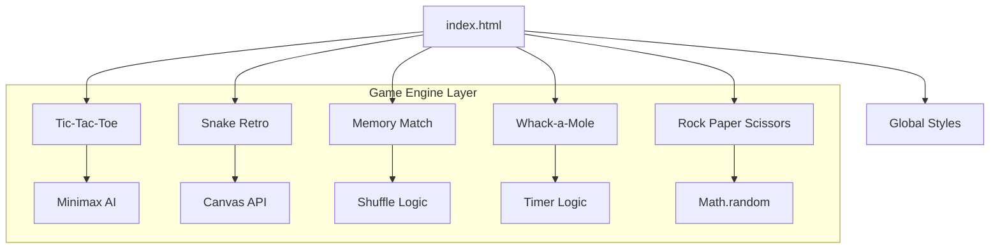

# 🏙️ OmniHub 24: Skyline Arcade

Welcome to **OmniHub 24**, a premium suite of classic retro games reimagined with a modern "Skyline" aesthetic. This project is a definitive collection of lightweight, high-performance JavaScript games, featuring advanced AI, canvas-based rendering, and 3D CSS physics.

**Created by [Chitkul Lakshya](https://github.com/ChitkulLakshya)**

---

## 🏗️ Architecture Overview

The project follows a **Modular Monolith** architecture where each game is a standalone mini-application housed within its own directory. This ensures high maintainability and zero coupling between different game logics.



---

## 📂 Folder Structure

```text
OmniHub-24/
├── index.html              # Main Dashboard Entry
├── style.css               # Global Neon Design System
├── README.md               # Documentation
└── games/                  # Standalone Game Modules
    ├── tic-tac-toe/        # Unbeatable AI Game
    │   ├── index.html
    │   ├── style.css
    │   └── script.js
    ├── snake/              # Canvas-based Retro Snake
    │   ├── index.html
    │   ├── style.css
    │   └── script.js
    ├── memory-match/       # 3D Card Flip Game
    │   ├── index.html
    │   ├── style.css
    │   └── script.js
    ├── whack-a-mole/       # Reflex Blitz Game
    │   ├── index.html
    │   ├── style.css
    │   └── script.js
    └── rps/                # Probability Battle Game
        ├── index.html
        ├── style.css
        └── script.js
```

---

## 🛠️ Tools, Languages & Frameworks

This project is built using a "No-Framework" philosophy to ensure maximum performance and zero dependency overhead.

### 🧰 Core Technologies
| Tool | Purpose |
| :--- | :--- |
| **HTML5** | Semantic structure and Canvas rendering context. |
| **CSS3** | Glassmorphic UI, 3D Transforms, and Custom Properties (Variables). |
| **JavaScript (ES6+)** | Core game engines, AI logic, and DOM manipulation. |

### 🎨 Design & Assets
- **Lucide Icons**: Used for crisp, scalable vector iconography across the dashboard.
- **Google Fonts (Outfit)**: A geometric sans-serif font for a premium, modern tech feel.
- **CSS Backdrop Filters**: For real-time glass-blur effects.

### 🧠 Logic & Algorithms
- **Minimax Algorithm**: Powering the unbeatable Tic-Tac-Toe AI.
- **Fisher-Yates Shuffle**: Ensuring true randomness in card placements.
- **RequestAnimationFrame**: Synchronizing Snake movement with the screen's refresh rate.

---

## 🕹️ The Game Suite

### 1. ❌ Tic-Tac-Toe (Advanced AI)
Experience the ultimate strategic challenge. Featuring an implementation of the **Minimax Algorithm**, the machine is mathematically unbeatable.

### 2. 🐍 Snake Retro
A high-performance HTML5 Canvas implementation of the arcade classic with dynamic frame-rate scaling.

### 3. 🧠 Memory Match
Test your cognitive recall in this 3D-accelerated card flipping game featuring CSS 3D transforms.

### 4. 🔨 Whack-a-Mole
A fast-paced reflex test set in the skyline shadows with randomized peep-intervals.

### 5. ✊ Rock Paper Scissors
A probability-based showdown against the machine using immediate feedback loops.

---

## 🚀 Getting Started

1. **Clone the repository**:
   ```bash
   git clone https://github.com/ChitkulLakshya/OmniHub-24.git
   ```
2. **Navigate to the directory**:
   ```bash
   cd OmniHub-24
   ```
3. **Run the app**:
   Simply open `index.html` in any modern browser.

---

*Built by Chitkul Lakshya.*

<!-- polish-v2-1 -->

<!-- polish-v2-2 -->

<!-- polish-v2-3 -->

<!-- polish-v2-4 -->

<!-- polish-v2-5 -->

<!-- polish-v2-6 -->

<!-- polish-v2-7 -->

<!-- polish-v2-8 -->

<!-- polish-v2-9 -->

<!-- polish-v2-10 -->

<!-- polish-v2-11 -->

<!-- polish-v2-12 -->

<!-- polish-v2-13 -->

<!-- polish-v2-14 -->

<!-- polish-v2-15 -->
